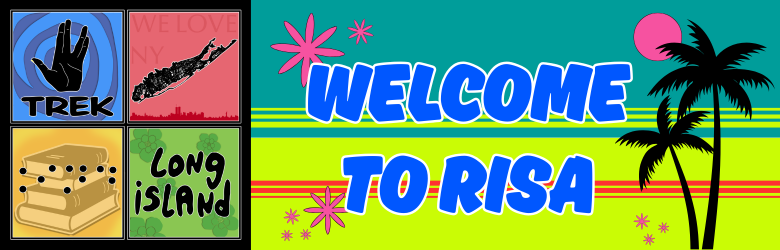
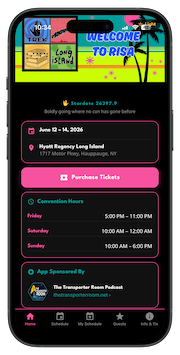
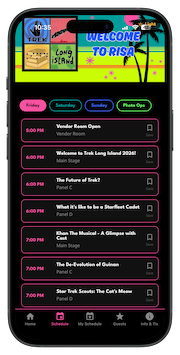
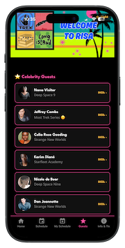
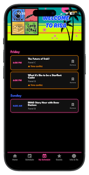
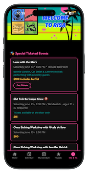

# 🖖 Trek Long Island 2026 — Official Convention App

> ⚠️ Launching on the **App Store** and **Google Play** in June 2026.

<div align="center">



### 📲 Download Coming Soon

[](#)
[](#)

_Links will go live when the app is approved — June 2026_

</div>

---

## 📌 About This Project

This is my **first commissioned, real-world project**, built for an actual client and real convention attendees.

**Trek Long Island** is Long Island's own Star Trek convention, running **June 12-14, 2026** at the Hyatt Regency Long Island. As a proud member of the [Trek LI crew](https://treklongisland.com/our-crew/), I was brought on to design and develop the official companion app for the event.

The app gives attendees everything they need in one place — the full schedule, celebrity guest profiles, ticketed events, venue info, and more.

---

## 🏨 Convention Details

|            |                                                                                |
| ---------- | ------------------------------------------------------------------------------ |
| 📅 Dates   | June 12-14, 2026                                                               |
| 📍 Venue   | Hyatt Regency Long Island                                                      |
| 🗺️ Address | 1717 Motor Pkwy, Hauppauge, NY                                                 |
| 🎟️ Tickets | [treklongislandtickets.square.site](http://treklongislandtickets.square.site/) |
| 🌐 Website | [treklongisland.com](https://treklongisland.com)                               |

---

## 📱 App Preview

<div align="center">

|                            Home                             |                            Schedule                             |                            Guests                            |                           My Schedule                           |                           Info & Tix                            |
| :---------------------------------------------------------: | :-------------------------------------------------------------: | :----------------------------------------------------------: | :-------------------------------------------------------------: | :-------------------------------------------------------------: |
|  |  |  |  |  |

</div>

---

## ✨ Features

| Feature                             | Description                                                           |
| ----------------------------------- | --------------------------------------------------------------------- |
| 🗓️ Interactive Schedule             | Tabbed navigation across Friday, Saturday, Sunday, and Photo Ops      |
| 🌟 Celebrity Guests                 | Full guest grid with headshots, Star Trek series info, and IMDb links |
| 🎭 Artists, Authors & Entertainment | Dedicated sections for all non-celebrity guests                       |
| 📅 My Schedule                      | Bookmark events and get automatic time conflict warnings              |
| 🎟️ Ticketed Events                  | All special events with prices and direct purchase links              |
| 🏨 Venue & Contact                  | Address, hours, social links, and department contacts                 |
| ⭐ Stardate Calculator              | Live stardate displayed on the home screen                            |
| 🌙 Light/Dark Mode                  | Dark by default, preference saved across sessions                     |
| 📻 App Sponsor                      | The Transporter Room Podcast featured on the home screen              |
| ♿ Accessibility                    | WCAG-compliant labels on all interactive elements                     |

---

## 🎨 Brand Colors

| Color | Hex       | Preview                                                  |
| ----- | --------- | -------------------------------------------------------- |
| Pink  | `#f652a0` |  |
| Teal  | `#009d9a` |  |
| Gold  | `#f3ba48` |  |
| Blue  | `#3f64f0` |  |
| Green | `#63fb64` |  |

---

## 🛠️ Tech Stack

|                  |                                            |
| ---------------- | ------------------------------------------ |
| Languages        | TypeScript                                 |
| Framework        | React Native + Expo SDK 56                 |
| Navigation       | Expo Router (file-based)                   |
| State Management | React Context + AsyncStorage               |
| Fonts            | League Spartan, Noto Sans, Bangers, Candal |
| Icons            | MaterialCommunityIcons                     |
| Build            | EAS Build                                  |
| Distribution     | Apple App Store & Google Play              |

---

## 📁 Project Structure

```
trek-li-app-2026/
├── assets/
│   └── images/          # Banner, sponsor logo, icons
├── docs/
│   └── screenshots/     # App preview screenshots
├── src/
│   ├── app/             # Expo Router screens
│   │   ├── index.tsx    # Home
│   │   ├── schedule.tsx
│   │   ├── my-schedule.tsx
│   │   ├── guests.tsx
│   │   └── info.tsx
│   ├── components/
│   │   └── ScreenHeader.tsx  # Banner + light/dark toggle
│   ├── context/
│   │   ├── ThemeContext.tsx
│   │   └── SavedEventsContext.tsx
│   ├── constants/
│   │   └── theme.ts
│   ├── hooks/
│   │   └── use-theme.ts
│   └── data/
│       └── scheduleData.ts
```

---

## 💻 Getting Started

```bash
# Clone the repo
git clone https://github.com/Babz-G/trek-li-app-2026.git

# Navigate into the project
cd trek-li-app-2026

# Install dependencies
npm install

# Start the web preview
npx expo start --web
```

> ⚠️ Expo Go is not supported with SDK 56. Use the web preview or an EAS development build.

---

## 👩‍💻 Developer

**Babz Gaynor**  
🎨 Graphic Designer | Jr Full Stack Developer | Aspiring UX/UI Designer

[](https://github.com/Babz-G)
[](https://www.linkedin.com/in/babzgaynor)

---

## 🔗 Trek LI Links

- 🌐 [Official Website](https://treklongisland.com)
- 🎟️ [Purchase Tickets](http://treklongislandtickets.square.site/)
- 📸 [Instagram](https://www.instagram.com/treklongisland/)
- 📘 [Facebook](https://www.facebook.com/TrekLongIsland)
- 🐘 [Mastodon](https://mastodon.world/@TrekLongIsland)
- 🛍️ [Official Merch on Etsy](https://www.etsy.com/shop/TrekLongIsland)

---

<div align="center">

_Built with 🖤 and 🖖 for the Trek LI crew and convention attendees_

</div>
